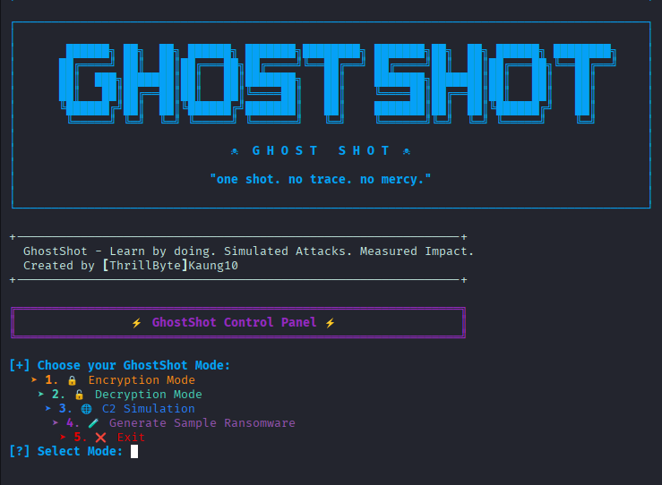
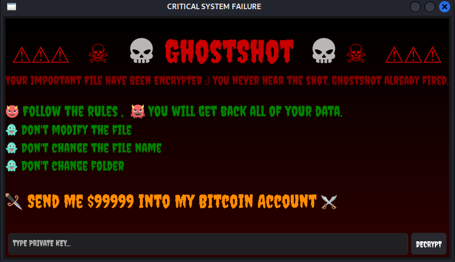
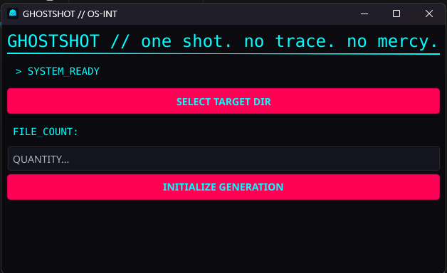
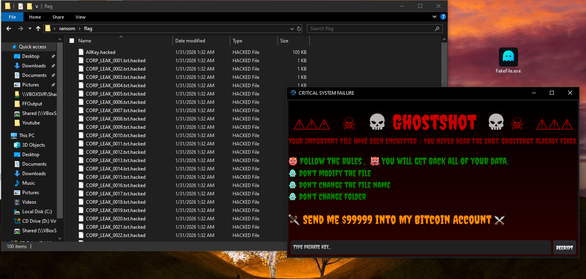
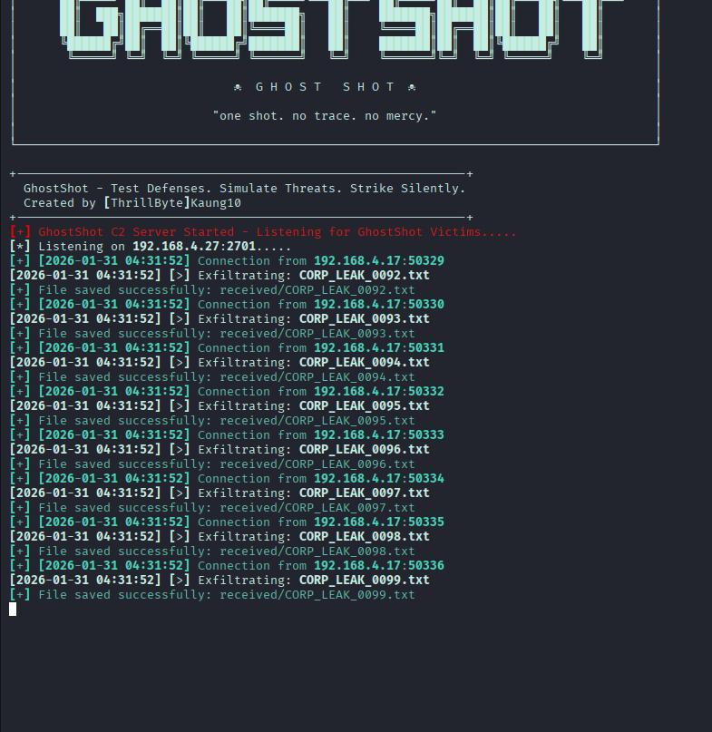
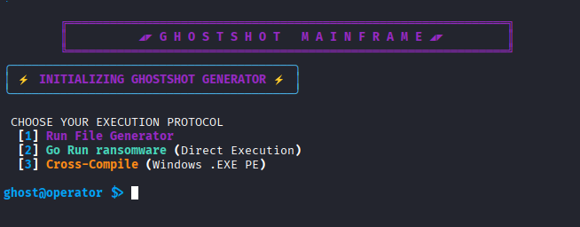

  <h1 align="center">GhostShot</h1>

---




# GhostShot: Ransomware Simulation & Defense Research Tool

This documentation provides a comprehensive overview of **GhostShot**, a framework designed for security researchers and system administrators to simulate ransomware behavior in controlled environments.

> [!IMPORTANT]
> 
> **DISCLAIMER:** This tool is strictly for educational purposes and authorized security testing. Unauthorized use of this tool against systems without explicit permission is illegal and unethical. The author is not responsible for any misuse or damage caused by this software.

---

## 📖 Table of Contents

* [1. Project Overview](#-1-project-overview)
* [2. Setup & Installation](#-2-setup--installation)
* [2.1 Installation Steps](#installation-steps)


* [3. Component Breakdown](#-3-component-breakdown)
* [3.1 FileGenerator.py](#-31-filegeneratorpy)
* [3.2 GhostShot.py (The Control Center)](#-32-ghostshotpy-the-control-center)
* [I. Encryption Logic](#-i-encryption-logic)
* [II. Decryption Logic](#-ii-decryption-logic)
* [III. C2 Simulation](#-iii-c2-simulation)
* [IV. Ransomware Generator](#-iv-ransomware-generator-go-integration)


* [4. Technical Architecture & Hybrid Encryption](#-4-technical-architecture--hybrid-encryption)
* [5. GhostShotC2.py (Command & Control Server)](#-5-ghostshotc2py-command--control-server)
* [6. License](#-license)

---

## 🚀 1. Project Overview

**GhostShot** is a modular ransomware simulation suite. Its primary goal is to help defenders understand the lifecycle of an encryption attack—from file discovery and encryption to Command & Control (C2) communication—thereby enabling the development of better detection signatures and recovery strategies.



---

## ⚙️ 2. Setup & Installation

The setup process automates the environment configuration, including Python virtual environments and necessary system dependencies like Docker and Go.

### Installation Steps

1. **Clone the Repository:**
    
    
    ```Bash
    git clone http://[your-repo-link]/GhostShot.git
    cd GhostShot
    ```
    
2. **Initialize Environment:**
    
    The `setup.sh` script handles the installation of the Python environment, Go (Golang), and Docker. It also initializes the Go project and manages library versions.
    
    
    ```bash
    chmod +x setup.sh
    ./setup.sh
    ```
    
1. **Activate Environment and Run:**
    
    ```Bash
    source ./venv/bin/activate
    
    python FileGenerator.py      # Generate test data first
    
    python GhostShot.py          # Launch the main simulator
    ```
    

---

## ✨ 3. Component Breakdown

### 🛡️ 3.1 FileGenerator.py

Before running a simulation, you need a target dataset. This script populates a directory with dummy data to ensure no real files are harmed during the test.

- **Functionality:** Generates dummy information files.
    
- **Configuration:** Folder name and file count are configurable at the start of the script.
    

### 💻 3.2 GhostShot.py (The Control Center)

This is the main interaction script providing a menu-driven interface for simulation tasks.

#### 🔐 I. Encryption Logic

- **Process:** User inputs a target folder path and a custom password.
    
- **Mechanism:** Uses **AES Cipher in CFB mode**.
    
- **Logging:** Password and path details are appended to `GhostShot_Output/pass&path.txt`.
    
- **Challenges & Solutions:**
    
    - _Variable Key Lengths:_ To ensure a valid 32-byte key regardless of password length, the tool uses a **SHA-256** hash of the user password.
        
    - _Recursive Encryption Prevention:_ To avoid encrypting a file twice, the tool appends a suffix (e.g., `important.txt.hacked`).
        

#### 🔐 II. Decryption Logic

- **Process:** Reverses the AES-CFB encryption using the provided password.
    
- **Challenge:** Ensuring data integrity. If a user manually modifies an encrypted file before decryption, the tool reports a "failed count" but will not attempt a corrupted recovery to prevent further data loss.
    

#### 💾 III. C2 Simulation

- **Functionality:** Simulates the exfiltration phase (Double Extortion).
    
- **Mechanism:** Establishes a TCP Socket Stream to a specified IP/Port.
    
- **Challenge:** Separating file data in a stream. The solution implements a "Connection per File" protocol to maintain file integrity during transfer.
    

#### 🐙 IV. Ransomware Generator (Go Integration)

GhostShot can compile a standalone ransomware binary written in Go. Go was selected for its cross-compilation capabilities and ease of GUI implementation (using libraries like Fyne).



---

## 🤖 4. Technical Architecture & Hybrid Encryption

To simulate modern, sophisticated ransomware, the generator utilizes a **Hybrid Encryption** scheme.
### The Encryption Challenge/Solution Matrix 😈

| **Challenge 😐**                                                                        | **Technical Solution 😏**                                                                                                               |
| --------------------------------------------------------------------------------------- | --------------------------------------------------------------------------------------------------------------------------------------- |
| **Offline Encryption:** How to encrypt without sending the key to a server immediately? | **RSA (Asymmetric):** Generate an RSA key pair. The public key is embedded in the binary to encrypt the session keys.                   |
| **Performance:** RSA is too slow for large files.                                       | **AES-GCM (Symmetric):** Use AES-GCM for the actual file data for high speed and integrity.                                             |
| **Memory Forensics:** Recovery of the AES key from RAM.                                 | **One Key Per File:** Every file is encrypted with a unique AES key. These keys are then encrypted with RSA and stored in `AllKey.txt`. |
| **System Stability:** Avoiding OS "bricking" (which prevents the victim from paying).   | **Exclusion List:** The engine skips `.dll`, `.log`, `.mui`, and `AllKey.txt` files to keep the OS functional.                          |

---

## 🗣️ 5. GhostShotC2.py (Command & Control Server)

This script acts as the receiver for exfiltrated data and session keys.

- **Operation:** Listens on a specified IP/Port for incoming TCP connections.
    
- **Protocol Logic:** To handle file metadata correctly, the server follows a two-step receive process:
    
    1. **Header:** The client sends the filename first.
        
    2. **Payload:** The client then streams the file content.
        
- **Dynamic Generation:** The **Ransomware Generator** allows the user to configure unique C2 IP addresses, ports, and RSA keys for each binary to simulate different "campaigns."
    

---

## 📖 License

Distributed under the TOE license. See `LICENSE` for more information.
